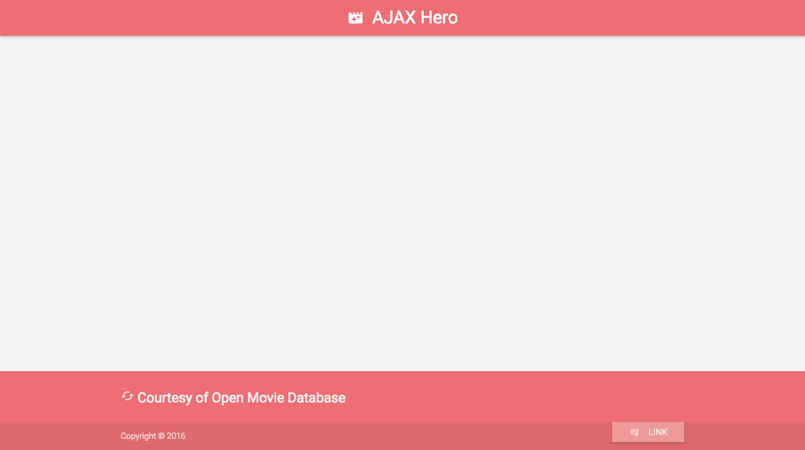

# Ajax Hero

In this exercise, you're tasked with extending this web application by making Ajax calls to the OMDb API and updating the DOM. To get started, fork and clone this repository.

### Exercise Goals

##### Goal 1:

- Hard code your website to display data without using a search field, e.g. your first call should be a search for "Star Wars"
- Dynamically create content using Materialize elements such as rows, columns, and cards
- Each card should display the movie title, poster, and a link to plot synopsis

> **HINT:** Since not all the poster images returned from OMDb are the same size, feel free to set all your image height/width the same so the cards will align better

##### Goal 2:

- When a user clicks on the "Plot Synopsis" button, display the plot using a modal
- The modal should display the title, release year, and full plot

![Screenshot of opened modal]
(img/screenshot3.png)

##### BONUS Goal:

- Add an input field that allows users to search for any movie they'd like

In the end, your website could look something like this, but feel free to get creative with color, design, search features, etc:

![Screenshot of finished AJAX Hero]
(img/screenshot1.png)
